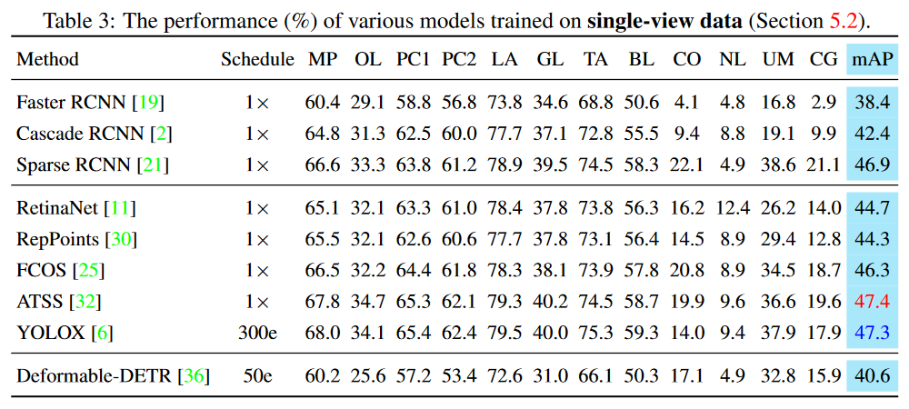

# LDXray: A Dataset for X-ray Prohibited Items Detection

## Introduction
LDXray is a large-scale dual-view dataset collected from real security scenes in transportation hubs. It contains a wide range of prohibited items categorized into 12 different classes.


## Experimental Results
We have extensively evaluated existing representative detection models and established baselines. Additionally, we have implemented several different strategies for utilizing side views, including:

### Baselines


### Data Augmentation


### Contrastive Learning


### Feature Fusion


## Dataset and Code Download
The dataset and code can be accessed from the following links:

- **LDXray Dataset**: [Kaggle](https://www.kaggle.com/datasets/yuzheguocs/LDXray) | [BaiduNetDisk](https://pan.baidu.com/s/1YyUcBe7usxMUb1UyzTorgQ?pwd=m5pl)
- **LDXray Benchmark**: [GitHub](https://github.com/rstao-bjtu/LDXray-mmdetection)

## Citation
If you use LDXray in your research, please consider citing:

```bibtex
@inproceedings{tao2024dual,
  title={Dual-view X-ray Detection: Can AI Detect Prohibited Items from Dual-view X-ray Images like Humans?},
  author={Tao, Renshuai and Wang, Haoyu and Guo, Yuzhe and Chen, Hairong and Zhang, Li and Liu, Xianglong and Wei, Yunchao and Zhao, Yao},
  booktitle={2025 IEEE/CVF Conference on Computer Vision and Pattern Recognition (CVPR)},
  year={2025},
  organization={IEEE}
}
```

## Contact
For any questions, please contact [Renshuai Tao](https://rstao-bjtu.github.io/).

---

